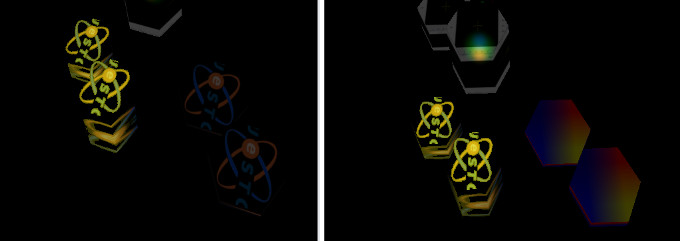

Debug Notes
===========

Three.js #14635 (Material instance)
-----------------------------------

test case::

    test/html/greate-cd.html

About the Three Module Issue
____________________________

.. attention:: This issue should no longer exists because all imports from
   packages/three/three.module.js are now directly from *three* package - not verified.
..

.. note:: It's worth to have a note after days of debugging.
..

EffectComposer and its depending passes are not included in the threejs bundle.
This makes x-visual have to import these modules via both by npm *three/examples/*
or by copying directly the source files.

As x-visual is using Mocha for test, the former method leads to another problem,
(see the *packages/README*,) which makes the latter method the only plausible way
- as to his knowledge limitation.

But the using threejs module source presented another issue, classes supposed to
be the same class are not as expected when checking with "instanceof".

There is a good example showing this issue.

In lib/sys/ext/finalcomposer.js, the system create a *ShaderPass* with a
THREE.ShaderMaterial will makes *ShaderPass* failed to check the the instance.

There are similar issue like `this question <https://stackoverflow.com/questions/47481703/three-effectcomposer-is-not-a-constructor/49211046>`_.

The code snippet causing the issue in lib/sys/ext/finalComposer.js/FinalComposer:

.. code-block:: javascript

    import * as THREE from 'three'
    import {ShaderPass} from  '../../../packages/three/postprocessing/ShaderPass'
    import {EffectComposer} from  '../../../packages/three/postprocessing/EffectComposer'

    class FinalComposer extends XSys {
        effects(x) {
            var effects = x.composer;
            effects.renderToScreen = false;
            this.effectPass = effects;

            this.finalCompose = new EffectComposer( x.renderer );

            var finalPass = new ShaderPass(
                // Should from packages/three.module.js, instead of THREE.ShaderMaterial
                new THREE.ShaderMaterial( {
                    uniforms: {
                        texScene: { value: null },
                        texEffects: { value: effects.renderTarget2.texture },
                    },
                    vertexShader: finalVert,
                    fragmentShader: finalFrag,
                } ),
                "texScene");
            finalPass.renderToScreen = true;
            this.finalCompose.addPass( finalPass );
        }
    }
..

The final composer sharing texture from effects composer (*effects*) rendering
target is essential to the result.

**Here is where the problem comes from**:

The packages/three/postprocessing/ShaderPass constructor check the *shader* arguments
with "*insanceof ShaderMaterial*" which is actually another class from ../three.module.js,
leading to an unexpected result.

.. literalinclude:: ../../packages/three/postprocessing/ShaderPass.js
   :language: javascript
   :lines: 5-40
   :linenos:

Texture Referenced Across Shaders
---------------------------------

Texture must been provided in uniforms to be bound to sampler2D in shader. Otherwise
the texture can be bound to a wrong sampler.

The left results from bug that without setting image (loaded as texture) to material
uniforms, making shader using wrong texture binding.

Hacking Three.js
----------------

Glsl Shader Source
__________________

**THREE.Revision 110**

ShaderId in renderers/webgl/WebGLPrograms.js,

.. code-block: javascript

    function WebGLPrograms( renderer, extensions, capabilities ) {

      var programs = [];

      ...

      var shaderIDs = {
        MeshDepthMaterial: 'depth',
        MeshDistanceMaterial: 'distanceRGBA',
        MeshNormalMaterial: 'normal',
        MeshBasicMaterial: 'basic',
        MeshLambertMaterial: 'lambert',
        MeshPhongMaterial: 'phong',
        MeshToonMaterial: 'phong',
        MeshStandardMaterial: 'physical',
        MeshPhysicalMaterial: 'physical',
        MeshMatcapMaterial: 'matcap',
        LineBasicMaterial: 'basic',
        LineDashedMaterial: 'dashed',
        PointsMaterial: 'points',
        ShadowMaterial: 'shadow',
        SpriteMaterial: 'sprite'
      };
      ...
..

In renderers/shaders/ShaderLib.js,

.. code-block: javascript

    var ShaderLib = {
      basic: {
        uniforms: mergeUniforms( [
          UniformsLib.common,
          UniformsLib.specularmap,
          UniformsLib.envmap,
          UniformsLib.aomap,
          UniformsLib.lightmap,
          UniformsLib.fog
      ] ),

      vertexShader: ShaderChunk.meshbasic_vert,
      fragmentShader: ShaderChunk.meshbasic_frag
    },
    ...
..

ShaderChunk packs all source grogram, like

.. code-block: javascript

    import meshbasic_frag from './ShaderLib/meshbasic_frag.glsl.js';
    import meshbasic_vert from './ShaderLib/meshbasic_vert.glsl.js';
..

Src: `meshbasic_vert <https://github.com/mrdoob/three.js/blob/master/src/renderers/shaders/ShaderLib/meshbasic_vert.glsl.js>`_
& `meshbasic_frag <https://github.com/mrdoob/three.js/blob/master/src/renderers/shaders/ShaderLib/meshbasic_frag.glsl.js>`_.

And WebGLRenderer, the three.js renderer, using WebGLPrograms.acquireProgram() to
get shader program.

Shader instance for LineBasicMaterial:

.. code-block: glsl

    // fragment
    uniform float opacity;
    uniform sampler2D tDiffuse;
    varying vec2 vUv;
    void main() {
      vec4 texel = texture2D( tDiffuse, vUv );
      gl_FragColor = opacity * texel;
    }

    // vertex
    varying vec2 vUv;
    void main() {
      vUv = uv;
      gl_Position = projectionMatrix * modelViewMatrix * vec4( position, 1.0 );
    }
..
