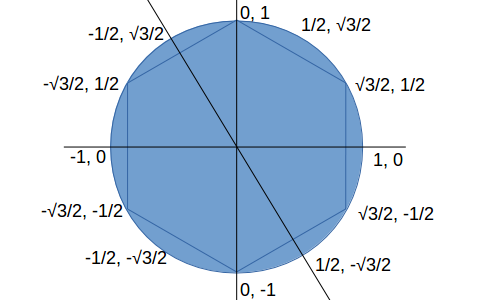

X-Geometry Handling
===================

MapXZRoad
---------

Obj3Type::

    xv.XComponent.Obj3Type.MapXZRoad

Handler API:

`xgeom.generateWayxz() <https://odys-z.github.io/javadoc/x-visual/xgeom.html#generateWayxz>`_

Test pages::

    test/html/map3d/geopath-road.html
    test/html/map3d/geopaths.html
    test/html/map3d/cd-express.html

See also :ref:`tst-geom-volume-tube`

.. _geom-hexatile:

hexatile
--------

Obj3Type::

    xv.XComponent.Obj3Type.Hexatile

test page::

    test/html/map3d/haxcylinder.html
    test/html/map3d/epsg4326-points.html

Where the hexagon tile are generated with the template:

Hexatile is generated as a hexagonal cylinder. Parameters example:

.. code-block:: javascript

    paras: {
      origin: o3,
      geostyle: {
        radius: 45, height: 24,
        scale: 0.02,
        maxHeight: 40,
        groups: 2,
        onGroup: (fx, feature) => { return fx % 2; }
      }
    }

- paras.origin

Specifying the geographically center of xworld

- paras.geostyle

Specifying how the cylinder been generated, where

-- geostyle.radius: circumvent circle radius.

-- geostyle.scale: geojson's coordinates scale to xworld.

-- geostyle.height: cylinder height, in xworld.

-- geostyle.maxHeight: max heigth that with the highest thermal color.

The thermal colors can word only with :ref:`tiledOrbs<visual-para-tiledorbs>`
shader. If a cylinder tile's heigth is higher than maxHeight, the higher part
will be applied with the max color.

-- geostyle.groups: total groups. Groups can be used by XTweener for showing different animation.

-- geostyle.onGroup: optional callback for getting group index according to feature.
