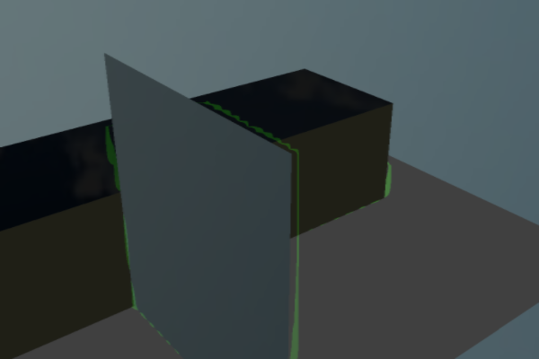
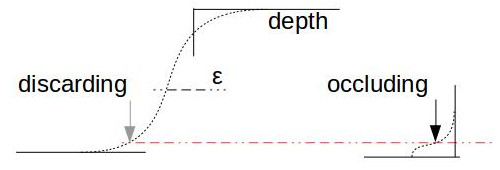

SSAO
====

Memo: Failed Experiment
-----------------------

Why Failed to detect AO with depth LOD.

Fragment Shader

.. code-block:: c

    uniform float u_ssaoRadius;
    uniform float u_ssaoIntense;
    uniform float u_ssaoLOD;

    vec2 ssaoSampling( sampler2D depth, vec2 uv0, float theta, vec2 r, float lod, float e ) {
        float ao = 0.;
        float w = 0.;

        vec2 sampleuv = uv0 + vec2(cos(theta), sin(theta)) * r;
        float us_ = texture( depth, sampleuv ).z;
        if (us_ + 0.1 * e < us2 && us2 - us_ < e) {
            ao = smoothstep(0., e, textureLod( depth, sampleuv, lod ).z - us2 );
            w++;
        }

        sampleuv = uv0 + vec2(cos(theta + Pi2_3), sin( theta + Pi2_3)) * r;
        us_ = texture( depth, sampleuv ).z;
        if (us_ + 0.1 * e < us2 && us2 - us_ < e) {
            ao = smoothstep(0., e, textureLod( depth, sampleuv, lod ).z - us2 );
            w++;
        }

        sampleuv = uv0 + vec2(cos(theta - Pi2_3), sin( theta - Pi2_3)) * r;
        us_ = texture( depth, sampleuv ).z;
        if (us_ + 0.1 * e < us2 && us2 - us_ < e) {
            ao = smoothstep(0., e, textureLod( depth, sampleuv, lod ).z - us2 );
            w++;
        }
        return vec2(ao, w);
    }

    float ssao(sampler2D tex, vec2 uv) {
        float epsilon = 0.01 * max(0.0001, 1. - us2 * us2);
        float lod = u_ssaoLOD;
        vec2 r = u_ssaoRadius / u_texsize / max(0.03, us2);
        float us = 0.;
        float w  = 0.;
        float us_ = texture( tex, uv, lod ).z;
        if (us_ + 0.1 * epsilon < us2 && us2 - us_ < epsilon) {
            vec2 aov2;
            for (int i = 0; i < 5; i++) {
                float d = float(i) / 5. * Pi2_3;
                aov2 += ssaoSampling( tex, uv, d, r, lod * 0.1, epsilon );
            }
            return max(us2 - aov2.x/15., 0.) * u_ssaoIntense;
        }

        return 0.;
    }
..

Parameters::

    finalQuad: {
        ssao: { radius: 8,
                intense: 2,
                depthLOD: 8,
            }
    }
