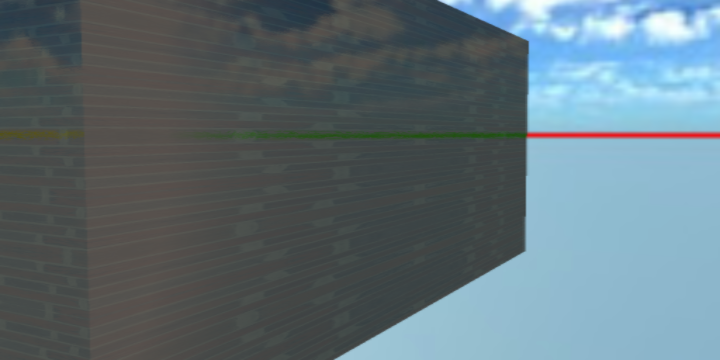
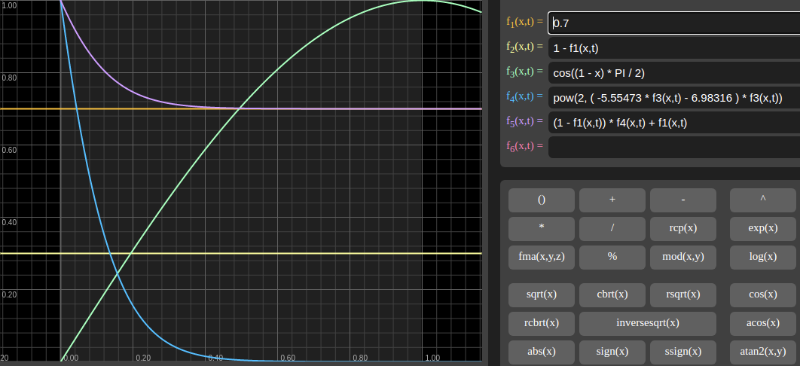

Fresnel Implementation
======================

Schlick Specular
----------------

This is an approximation by Schlick[1], and presented by [2], used and copied
from [3].

.. image:: imgs/102-fschlick-specular-result.png

x-visual shader
_______________

source::

    lib/xutils/shaders/glx.glsl.js

.. code-block:: c

    vec3 fSchlick_specular( vec3 col, vec3 incident, vec3 viewDir, float rough) {
        incident = normalize(incident) ;
        float dotLH = clamp( dot( incident, normalize(viewDir) ), 0., 1. );

        float fresnel = exp2( ( -5.55473 * dotLH - 6.98316 ) * dotLH );
        vec3 Fr = max( vec3( 1.0 - rough ), col ) - col;

        return Fr * fresnel + col;
    }
..

Schlick Fresnel
---------------

x-visual shader
_______________

source::

    lib/xutils/shaders/glx.glsl.js

.. code-block:: c

    vec3 fSchlick( vec3 col, vec3 incident, vec3 viewDir, float rough) {
            incident = normalize(incident) ;
            vec3 halfDir = incident + normalize(viewDir);
            float dotLH = 1. - clamp( dot( incident, halfDir ), 0., 1. );

            float fresnel = exp2( ( -5.55473 * dotLH - 6.98316 ) * dotLH );
            vec3 Fo = max( vec3( 1.0 - rough ), col ) - col;

            return Fo * fresnel + col;
        }`,
..

Additional Info
---------------

where::

    f1(x, t) = 0.7                        // normal color
    f2(x, t) = 1 - f1(x, t)               // 1 - F0
    f3(x, t) = cos((1 - x) * PI / 2)      // dot(V, H)
    f4(x, t) = pow(2, ( -5.55473 * f3(x,t) - 6.98316 ) * f3(x,t))
    f5(x, t) = (1 - f1(x,t)) * f4(x,t) + f1(x,t)

For Graphtoy, see [4].

References
----------

[1] Schlick, Christophe, “An Inexpensive BRDF Model for Physically-based Rendering”, Computer
Graphics Forum, vol. 13, no. 3, Sept. 1994, pp. 149–162.
http://dept-info.labri.u-bordeaux.fr/~schlick/DOC/eur2.html

[2] Brian Karis, Epic Games, Real Shading in Unreal Engine 4
`(Online PDF) <https://cdn2.unrealengine.com/Resources/files/2013SiggraphPresentationsNotes-26915738.pdf>`_

[3] Mrdoob, github.com,
`three.js/src/srcbsdf.glsl.js F_Schlick() <https://github.com/mrdoob/three.js/blob/b15bd85b2fd5b669393677a772bbf07291954645/src/renderers/shaders/ShaderChunk/bsdfs.glsl.js#L59>`_

[4] Graphtoy v0.4 by Inigo Quilez, https://graphtoy.com
