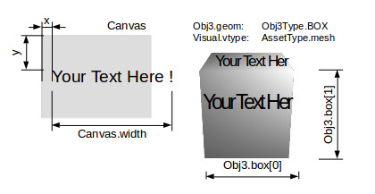

.. _visual-renderer:

Visual & Assets
===============

X-visual rendering 3d scene with Three.js, wrapped in a rendere, Thrender system.
The Thrender handling 2 components, Visual & Obj3, by converting parameters in a
Visual to Obj3. The later is represented in scene as an `THREE.Object3D <https://threejs.org/docs/index.html#api/en/core/Object3D>`__
object.

- Visual

The Visual Component specify the visual effect such as material texture asset or wireframe type.

- Obj3

The Obj3 Component specify the geometry or shape such as plane, box or path type.

See :ref:`obj3-transform-guide`

Thrender
--------

Thrender is the xv default renderer, handling Visual and Obj3 components. Created by xworld.startUpdate().

Example:

.. code-block:: javascript

        var cube = ecs.createEntity({
            id: 'cube0',
            Obj3: { geom: Obj3Type.BOX,
                    box: [200, 120, 80],    // bounding box
                    mesh: undefined },      // Thrender will create this from Visual
            Visual:{vtype: AssetType.mesh,
                    // Three use document to load assets, which doesn't exist while testing.
                    // 'null' acts as a flag to let thrender create a ram texture.
                    asset: null },
            });
..

Visual.vtype & Obj3.geom Handling
+++++++++++++++++++++++++++++++++

Visual.vtype specify an AssetType;

Obe3.geom specify shape or model type.

When Thrender is created by xworld.startUpdate(), all entities' Obj3 components
will been converted to a scene object, with visual effect of Visual component.

Model geometry and material are good examples to get this idea. Another is the
point visual and points object, where point is a visual effect a points array,
the scene object consists many points.

Visual.vtype
____________

.. _vtype-point:

- AssetType.point

The created `THREE.Object3D <https://threejs.org/docs/#api/en/core/Object3D>`__
will be rendered as an array of WebGl points.

The point type's material can only be a `THREE.ShaderMaterial <https://threejs.org/docs/index.html#api/en/materials/ShaderMaterial>`_.

.. _vtype-refPoint:

- AssetType.refPoint

Same as *point*, except that this type use the *asset* property specifying entity id
of which the vertices' position is copied from, the entity's Obj3.mesh.

The refPoint type's material can only be a `THREE.ShaderMaterial <https://threejs.org/docs/index.html#api/en/materials/ShaderMaterial>`_.

Visual.paras
____________

Visual.paras has different usage for different vtype.

See :ref:`visual parameters for different types<visual-paras>`.

Visual.asset
____________

Specify a gltf asset file, e.g. int the test case of html/gltf:

::

    test/html/gitf-city.html/script/Citysys.initCity(),

    Visual.asset: 'city/scene.gltf'

The file located in 'assets/city/scene.gltf' and referenced bin file together with
texture files are loaded by :ref:`xv-gltf-loader` of gltf loader.

Dynamic Text
------------

AssetType::

    xv.AssetType.mesh,

Component::

    Dynatex: {
        text,
        xywh,
        dirty: true,
        style
    }

test::

    test/html/dynatex.html
    test/html/dynatex-2.html

In x-visual, 2D text are supported by system `CanvTex <https://odys-z.github.io/javadoc/x-visual/XComponent.Dynatex.html>`_
using an html canvas as the dynamic texture, with an API function for updating
text.

The *Dynatex.style* and *Dynatex.font* are used as canvas style and font attribute,
the same as html canvas style, see `MDN Canvas.style <https://developer.mozilla.org/en-US/docs/Web/API/CanvasRenderingContext2D/fillStyle>`_
and `css font <https://developer.mozilla.org/en-US/docs/Web/CSS/font>`_.

.. _render-dynatex-xywh:

xywh & transform:

Define canvas, font box and transform.

Canvas size, font size and scene objects are working together to produce the 3D
visualized effects, while transform declare child alignment - mainly using scale
and translate to align text.

Example:

.. code-block:: javascript

    Visual:{vtype: xv.AssetType.mesh},
    Dynatex: {
        style: '#00c0c0',
        font: 'Arial',
        xywh: {x: 2, y: 128, w: 256, h: 48, size: 64, margin: 1}
    }

Default text is::

    font: "bold sans-serif",
	xywh: {x: 0, y: 0, size: 32, margin: 0} // w,h must presented

Also note that the font width is measured with html/canvas-2d-context, with height
scaled with measured/width. With this scale, the canvas can't simply been set to
size of power 2. So normally browser will warn about this. Before near future,
ignoring the message can be the only option.

GLTF Nodes & Transform
----------------------

AssetType::

    xv.AssetType.gltf

Visual.paras::

    nodes: string | array<string>, nodes name in gltf.
           If ignored, will load entire gltf scene.
    withTransform: apply node's transformation provided by gltf as node's matrix.

test::

    html/gltf-car.html
    html/gltf-city.html
    html/gltf-verts.html

See also :ref:`test case about gltf<test-gltf>`.
