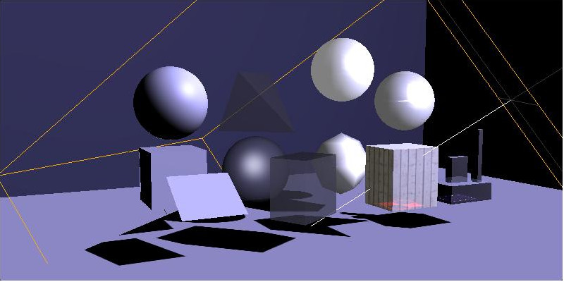

.. _test-xworld:

Test - ECS & XWorld
===================

Cate: xscene
------------

.. _test-xworld-light:

case: x.light
_____________

html file::

    test/html/esc-basics/light.html
    test/html/morph-events.html

AssetType::

    xv.XComponent.AssetType.mesh

ShaderFlag::

    xv.Component.ShaderFlag.colorArray
    xv.Component.ShaderFlag.texPrism
    xv.Component.ShaderFlag.boxLayers
	... and any future implement with f_LIGHTENED = 1

The test created some objects with materials provided by Three.js, and some material
extended by x-visual for special purpose.

The light position is indicated by a wireframe object, showing how different of
x-visual material extension vs. Three.js'. The left most (-x) 3 objects using
Three.js material objects have light effects of
`Three.HemisphereLight <https://threejs.org/docs/#api/en/lights/HemisphereLight>`_ .

The *colorArray*, *texPrism* & *boxLayers* shaders are applied to the rest of the
objects, mixing light's diffuse color with the material's texture. E.g. the
colorArray's morphing result color is mixed with an extra diffuse color. See the
'morph-events.html' test for the morphing animation result.
