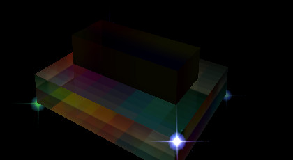
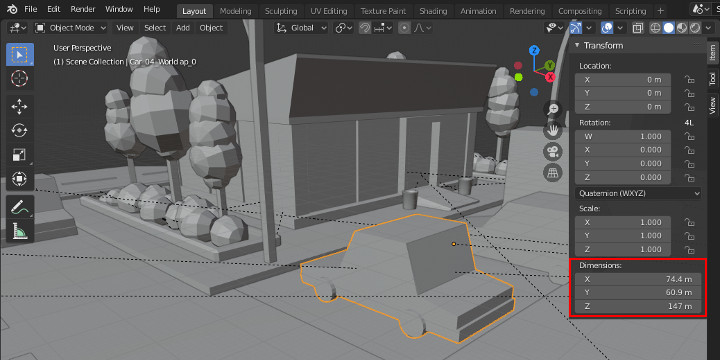

.. _test-morph:

Test - Morphing & Uniform
=========================

Cate: Morphing transform & color
--------------------------------

case: AnimType.U_ALPHA, U_MORPHi
________________________________

html file::

    test/html/morph/lerp-model.html
    test/html/voxel-morph.html
    test/html/voxel-morph-particles.html

The test defined 2 box object, with the 3rd as points referencing the boxes' vertices
and moving the points while changing the alpha.

A test case for basic morphing scripts.

.. literalinclude:: ../../test/html/morph/lerp-model.html
   :language: javascript
   :lines: 73-115
   :linenos:

In MorphSeqs.script, the moving points, entity id of 'points', is defined as a
*refPoint*, which makes the points object will be created according to the referenced
object's mesh vertices, defined with *asset* = "entity1".

The morphing target is defined with uniforms.a_dest = 'entity2'. Tween value is
been tweened in between values defined in *u_morph* = [0, 1]. This makes vertices
of *points* will moving between box of *entity1* & *entity2*.

In this case only *u_morph* and *u_alpha* are supported by shader *randomParticles*.

.. _tst-morph-group-alpha:

case: U_ALPHA (Groups & Lines)
______________________________

Since v0.3.18, U_ALPHA is supporting children updating, i.e. parent mesh.material.
uniforms.u_alpha will be copied to mesh.chirldren.uniforms.u_alpha. This copying
can support alpha morphing for mesh trees like Dynatex.

.. image:: imgs/006-group-alpha.jpg
    :width: 400px

html file::

    test/html/morph-alphas.html
    test/html/dynamic-group-affine.html

The upper left curve can be animated with AnimType.U_ALPHA. But the middle left
curve can't animated with U_ALPHA because there is a *dashSize* property and x-visual
created a curve using THREE.LineDashedMaterial.

The upper right text have a *apply2Children* property of true, which makes x-visual
try updating all it's children's uniform.u_alpha. If the children meshes can be
animated with u_alpha, the children meshes will also been updated.

The lower right is a group of lines using THREE.LineSegments object, which is not
actually a group. 'LineSegments using gl LINES mode for rendering <https://threejs.org/docs/index.html#api/en/objects/LineSegments>`_.

*U_ALPHA* can also been applied to children, if both parent & children can support
uniforms.u_alpha. The 2nd test page *dynamic-group-affine.html* shows this. See
:ref:`guid-animtype-ualpha`.

case: AnimType.POSITION
_______________________

html file::

    test/html/morph/lerp-model.html

This test shows how to update target position and use a animation to move to there.

.. literalinclude:: ../../test/html/affine-dynamic-target.html
   :language: javascript
   :lines: 69-98
   :linenos:

The user command interaction is handled in TestDynamicPos.update().

case: GLTF Handling
-------------------

.. _test-gltf:

case: AnimType.gltf
___________________

html file::

    test/html/gltf-city.html
    test/html/gltf-car.html
    test/html/gltf-verts.html

About nodes' transformation:

The gltf nodes include a property of matrix, which is usually set by assets' artists.
As gltf nodes can be a tree structure, loading some nodes can cause problem if
applying the node's transformation.

The x-visual provide a brutal solution for this - just ignore all transformation.
User can specify each node's transformation in Obj3. The gltf-car.html used both
methods. The road is using the gltf transformation, withTransform = true; while
cars completely ignored all transformation and configured with a new set of paras.

.. image:: imgs/003-gltf-car.jpg

case: GLTF transform
____________________

html file::

    test/html/gltf-city.html
    test/html/gltf-car.html

The 1st file loaded the entire gltf scene, without any post handling, but only
transformed. Transformation are kept the same as the source assets, only within
a single scene which is possible.

The 2nd file is a test of different gltf scale transformation. Gltf assets for the
scene come from 3 different gltf files::

    test/html/assets/city/scene.gltf
    test/html/assets/earth/earth-low.gltf
    examples/route66/route66.gltf

Here is a comparison of how different for different assets artists like to do.

.. image:: imgs/005-route66-car-size.jpg
    :width: 340px

In the testing html, the 2 cars are using different transformation set by programmer.

Left car:

.. code-block:: javascript

    var nostalgicar = ecs.createEntity({
        id: 'car66',
        Obj3: { transform: [
                    { translate: [-530, -80, -700] },
                    { scale: [30, 30, 30] } ] },
        Visual:{vtype: xv.AssetType.gltf,
                paras: {nodes: ['CAR'],
                        withTransform: false},
                asset: '../../../examples/route66/assets/route66.gltf'}
    });

Right car:

.. code-block:: javascript

    var car_4 = ecs.createEntity({
        id: 'car4',
        Obj3: { transform: [
                    { rotate: {deg: -90, axis: [0, 1, 0]} },
                    { translate: [120, -80, -360] },
                    { scale: [1, 1, 1] } ] },
        Visual:{vtype: xv.AssetType.gltf,
                paras: {nodes: ['Car_04'],
                        withTransform: false},
                asset: 'city/scene.gltf'}
    });

Cate: GLTF Nodes & Animation
____________________________

html file::

    test/html/gltf-car.html

This file loaded the some nodes in gltf asset, specifying animation scripts.

The animation can't auto-started for :ref:`the issue of asynchronous loading<issue-asynch-gltf>`.

To use and loading gltf nodes, user must have some basic idea of gltf format.
X-visual is intend for users of programmer.
Here is some information about :ref:`GLTF Format<gltf-format>`.

FYI, usually artists sometimes would not seriously care about how node's matrices
are working. In a GLTF scene, a node's transformation is combined all of it's
ancestors. So the node's transformation matrix itself will not makes what the
objects should look like. X-visual provided a brutal way, just disable all the
transformation in GLTF assets, with *Visual.paras.withTransform* = false, then
set Obj3.transform as you, the programmer like.

.. _tex-color-morph:

case: Color & Texture Morphing
______________________________

html file::

    test/html/morph-color.html

The test shows how color & texture can be morphed with help of shader *colorArray*.

For Visual.paras of *colorArray*, see :ref:`Visual.paras of colorArray<visual-paras-color-array>`.

**FYI** This page uses svg as rendered texture with help of Three.js CanvasTexture,
which can't be a scalable image instead. See :ref:`wish list, SVG<wish-svg>`.
