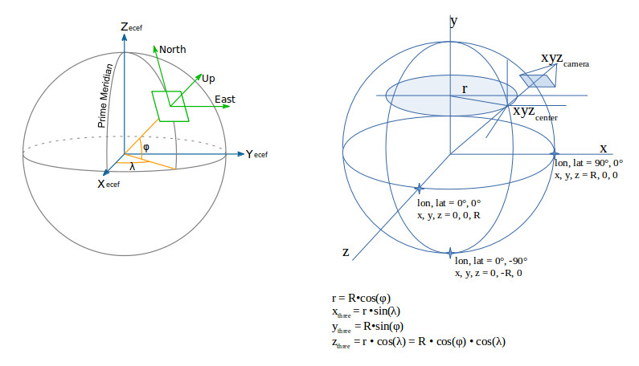

# About

Js OSM tile renderer in 3D world, powered by [Three.js](https://threejs.org).

# Coordinate system, the x-visual way

# References

- Geographic coordinate system, wikipedia,
https://en.wikipedia.org/wiki/Geographic_coordinate_system

- Making maps compatible with GPS, Transformations between The Irish Grid and
the GPS Co-ordinate Reference Frame WGS84 / ETRF89, Government of Ireland 1999
and Crown Copyright 1999, file:///home/ody/docs/personal/svn-zb/notes/references/gis/transformations_booklet.pdf

[svn](svn/notes/references/gis/pdf)

- [Three.js Coordinate System](https://discoverthreejs.com/book/first-steps/first-scene/)

- [illustrated](https://discoverthreejs.com/static/images/first-steps/coordinate_system.svg)

# Note

window and Blob is not supported by Node, so can't run code referencing these.
Lot of issues.
